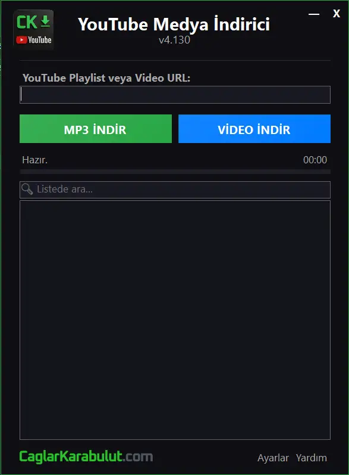
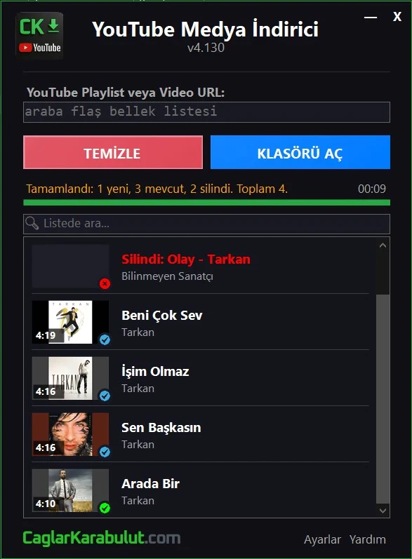
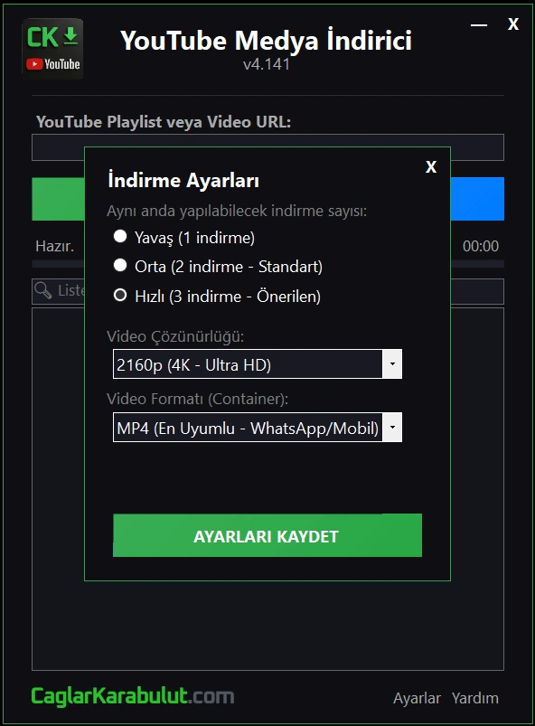

#  YouTube Medya İndirici (v4.141)

**YouTube Medya İndirici**, YouTube üzerinden yüksek kalitede video ve ses dosyalarını (MP3) hızlı ve kolay bir şekilde indirmenize olanak tanıyan, modern arayüzlü ve taşınabilir (portable) bir Windows uygulamasıdır.

---

## ✨ Özellikler

- 🌑 **Modern Karanlık Tema:** Windows 11 tasarım diliyle uyumlu, minimalist ve göz yormayan arayüz.
- 🎵 **Çoklu Format Desteği:**
  - **Ses:** Yüksek kaliteli MP3 indirme.
  - **Video:** MP4, MKV ve WebM formatlarında 1080p, 720p ve 480p çözünürlük seçenekleri.
- 📂 **Playlist Desteği:** Tek bir URL ile tüm oynatma listesini otomatik olarak tarama ve indirme.
- ⚡ **Eşzamanlı İndirme:** Ayarlanabilir indirme hızı (Yavaş, Orta, Hızlı) ile aynı anda birden fazla dosya indirme imkanı.
- 🔄 **Otomatik Güncelleme:** Uygulama motorunun (`yt-dlp` ve `ffmpeg`) her zaman en güncel sürümde kalmasını sağlayan yerleşik güncelleme sistemi.
- 📊 **Detaylı Özet:** İndirme işlemi sonunda başarılı, mevcut ve hatalı dosyaları gösteren interaktif özet ekranı.
- 🚀 **Taşınabilir (Portable):** Kurulum gerektirmez; sadece `.exe` dosyasını çalıştırın ve kullanmaya başlayın.

---

## 📸 Ekran Görüntüleri

## 🛠️ Kurulum ve Kullanım

1.  **İndirme:** Repository'den (`YoutubeIndirici.exe`) dosyasını indirin.
2.  **Çalıştırma:** Uygulamayı çift tıklayarak başlatın. İlk açılışta gerekli araçlar (`yt-dlp`, `ffmpeg`) otomatik olarak indirilecektir.
3.  **İndirme:**
    - İndirmek istediğiniz videonun veya playlistin linkini ilgili alana yapıştırın.
    - **MP3 İndir** veya **Video İndir** butonlarından birine tıklayın.
    - İndirilen dosyalar otomatik olarak uygulama klasörü içindeki `mp3` veya `video` klasörlerine kaydedilecektir.

---

## ⚙️ Gereksinimler

- **İşletim Sistemi:** Windows 10/11 (x64)
- **Framework:** .NET 9.0 Runtime
- **İnternet Bağlantısı:** Video indirme ve motor güncellemeleri için gereklidir.

---

## 🏗️ Teknolojiler

- **Dil:** C#
- **Platform:** .NET 9 WinForms
- **Core Engine:** [yt-dlp](https://github.com/yt-dlp/yt-dlp)
- **Media Engine:** [FFmpeg](https://ffmpeg.org/)

---

## 📜 Değişim Günlüğü

## Uygulamanın sürüm geçmişine [CHANGELOG.md](CHANGELOG.md) dosyasından ulaşabilirsiniz.

---

## 📄 Lisans

## Bu proje kişisel kullanım için geliştirilmiştir. İndirilen içeriklerin telif haklarından kullanıcı sorumludur.

_Geliştirici: caglarkarabulut94_
